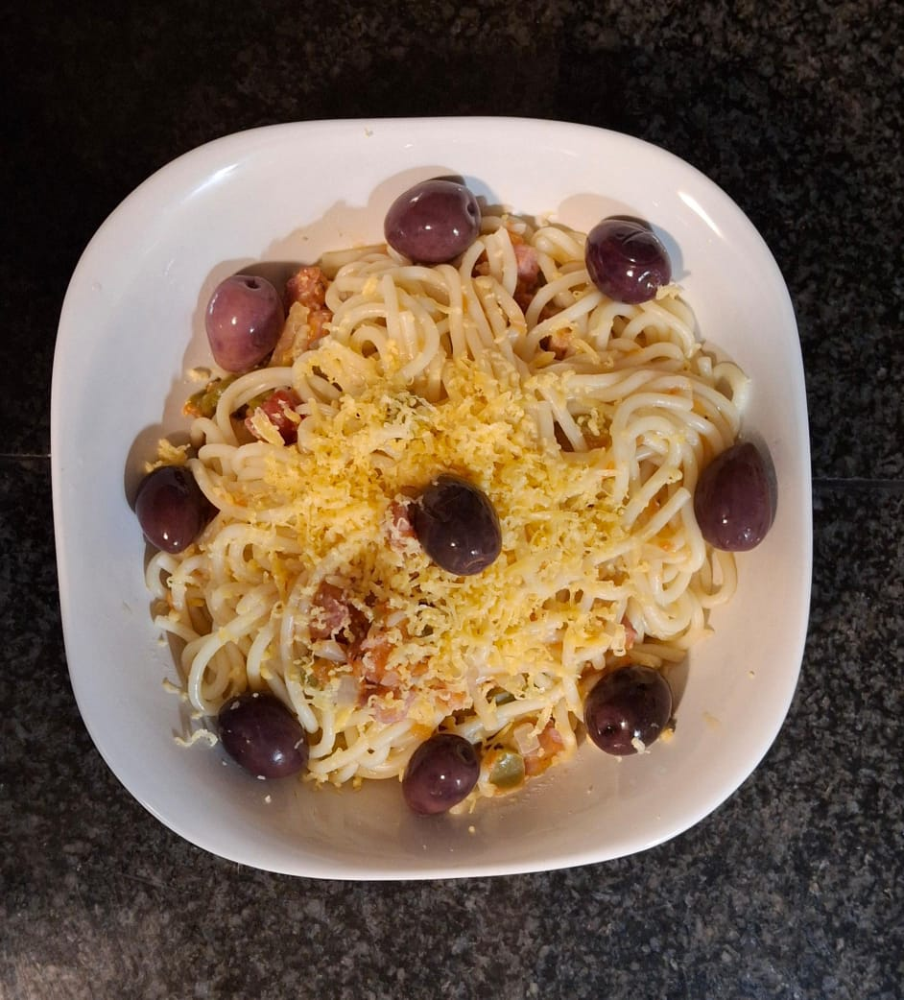

# Spaghetti all'Amatriciana

## Apparatus
- Pot for cooking spaghetti  
- Frying pan or stir fry pan  
- Cheese grater  
- Blender (recommended) or vegetable grater for pureeing tomatoes  
- Knife  
- Cutting board  
- Stove  

Spaghetti alla Amatriciana served with grated cheese and garnished with olives.

## Ingredients
- 200g spaghetti  
- 1/2 green bell pepper, sliced  
- 3 large tomatoes, pureed  
- 3 garlic cloves, minced  
- 1/2 large onion, sliced  
- 100g bacon (or guanciale), diced  
- 1/2 teaspoon salt  
- 3/4 teaspoon ground black pepper  
- 50g cheese (Pecorino Romano recommended, but any cheese will do), grated (optional)  
- 60ml extra virgin olive oil or any cooking oil  
- Pitted olives, for garnish (optional)  

## Method
1. Heat the olive oil in a large pan over medium heat.  
2. Add the diced bacon (or guanciale) to the pan and cook until crispy.  
3. Add the sliced bell pepper, minced garlic, and sliced onion to the pan. Sauté until the vegetables are tender.  
4. Pour in the pureed tomatoes and stir well to combine.  
5. Season the sauce with salt and ground black pepper. Stir well.  
6. Bring the sauce to a boil, then reduce the heat and simmer until the sauce thickens to your desired consistency.  
7. While the sauce is simmering, cook the spaghetti according to the package instructions until al dente. Drain and set aside.  
8. Once the sauce is ready, add the cooked spaghetti to the pan and toss to coat evenly with the sauce.  
9. Drain any excess water.  
10. Optionally, grate cheese over the spaghetti and/or garnish with pitted olives after serving.  

